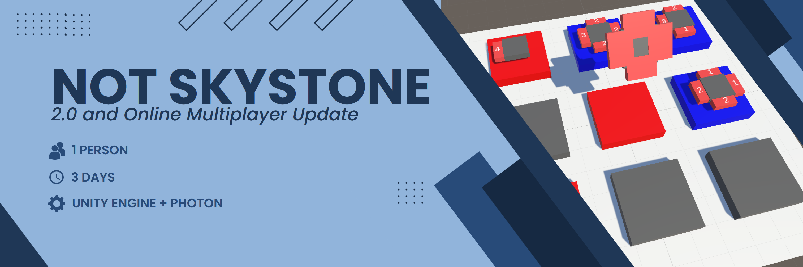
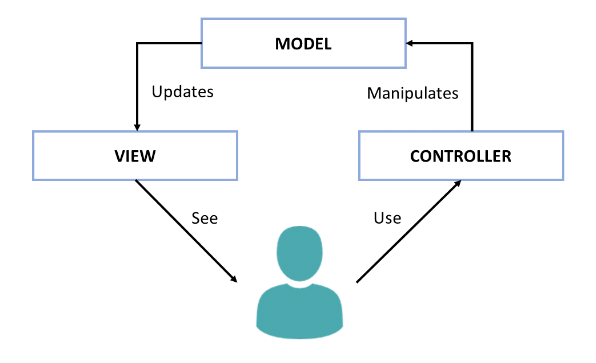

# Not-Skystones

     

"Not Skystones" is a prototype clone of a minigame called ["Skystones"](https://skylanders.fandom.com/wiki/Skystones) from the Skylanders videogame series. This small project was made as a practical example of the MVC code pattern that I was learning about at the beginning of my <b>3. Semester </b> at the [S4G-School for Games](https://www.school4games.net/).

# Gameplay
https://github.com/BasKrueger/Not-Skystone/assets/147401575/52d904b3-d42a-4e3a-9048-9bfd0e11d749

"Not Skystones" is a turn based pvp strategy board game. Players are playing their stones on the free spaces of a 3x3 gameboard. Each stone also has attack power in each of the 4 direction. If you play your stone adjecent to one that's under the enemies control, and your stone has more power in the enemy stones direction, than the enemy stone has power in your stones direction, then you take control of the enemy stone. The game ends after there are a total of 9 stones on the board and the player who controls most of them wins the game. 

# How to run
Clone this repository and open the project folder using at least Unity Version 2021.3.1. Alternatively you can play the latest build of the prototype right [here](https://suchti0352.itch.io/not-skystones) in your browser.

# Highlight: Model View Controller Pattern
This prototype makes extensive use of the Model View Controller (short MVC) pattern. There are many different definitions out there for this specific Code pattern, but I oriented myself on the following guidelines: 

     

The entire gamelogic (Model) is completely encapsulated from the rest, only offering specifically designed interfaces that's used by the Input (Controller). The Views responsibility is to display the latest state of the Model.
